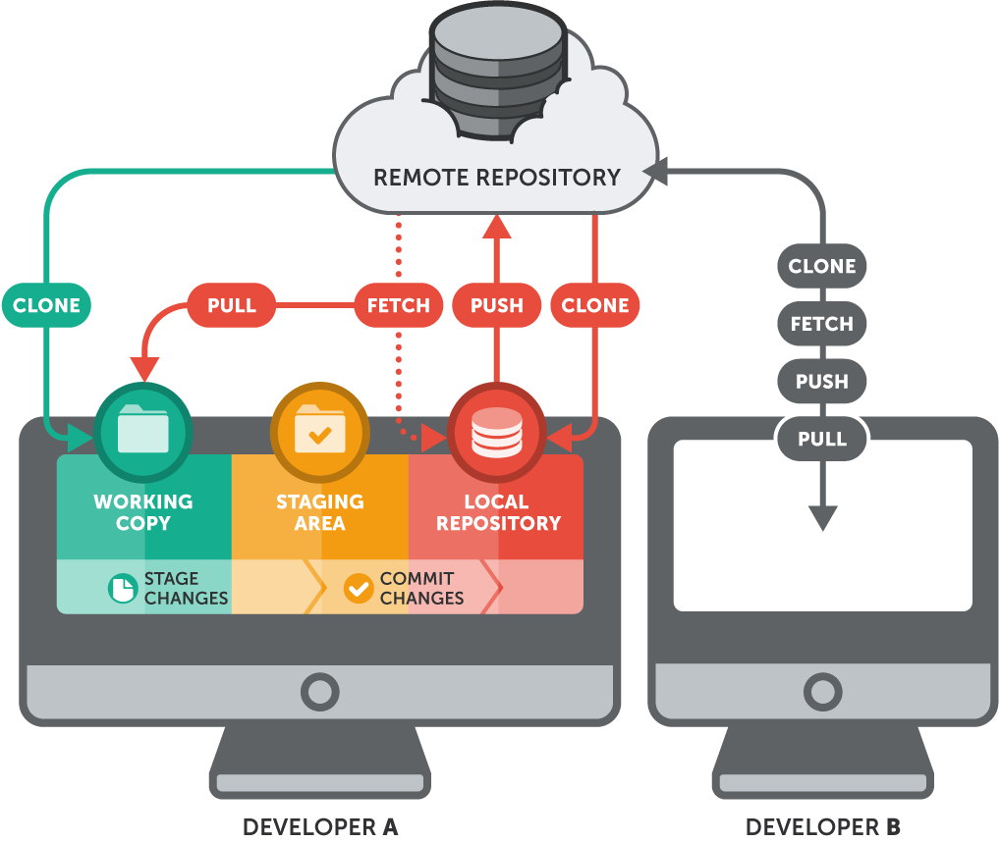

# Gitlab
## Introduction
In the previous assignment you saw how you can create a Git repository locally (on your own laptop or computer) and make changes or revert to it. You have also seen how you can create branches locally and merge or delete them.

In order to collaborate with others, you need a Git repository that your teammates can access, a so-called "remote repository". Remote repositories are located on the internet and depending on the rights, others can view and / or modify the code. The picture below shows the relationship between a local repository (on your laptop) and a remote repository.



By now you should be familiar with terms like "Working copy", "Staging area" and your "Local Repository". Using `git add` you move your changes from the working directory to the staging area. You can save these changes to your local repository with `git commit`. With a remote repository, you have to go the extra mile to sync your local repository with the remote repository (for example, a repository on GitLab). You do this with the help of `git push`. To update your local repository with the changes from the remote repository, use `git pull` or `git fetch`.

## Tasks
### Create a GitLab account
For this assignment you need to have access to a remote repositories on GitLab. Go to [gitlab.com](http://gitlab.com) and sign up for a free account (use your Saxion email address). With this account you can create, clone, push and pull repositories. Be sure to select the role 'Software Developer' in order to get the proper configuration for your account. 
      
You can skip the parts for creating a new project or organization.

### Create an SSH key for your GitLab account
There are two ways to access a remote repository, using HTTPS and SSH. The latter is recommended so generate a new SSH key pair and add it your GitLab account. 

You can generate a key as follows (skip the passphrase):
```sh
ssh-keygen -t ed25519 -C "Captain Awesome's MacBook key"
```
Also see the documentation [here](https://docs.gitlab.com/ee/ssh/index.html#generate-an-ssh-key-pair) on how to generate SSH keys.

Instructions on how to add your (public) key to GitLab can be found [here](https://docs.gitlab.com/ee/ssh/index.html#add-an-ssh-key-to-your-gitlab-account).

### Install Python
We're going to use the Python programming language in one of the assignments. Install it on Windows/WSL using:
```sudo apt-get install python```

Or on MacOS:
```brew install python```


## Assignment
### 1. Create a git repository
Your first task is to create a blank repository in GitLab. The easiest way to achieve this is by going to [gitlab.com](http://gitlab.com) using your browser and create a new project. Select "Create blank project" from the options. Be sure that your repository is private and that you initialize it with a README.

Once you have successfully created your repository then clone it so you can access the code locally on your laptop. You should use the "Clone with SSH" option so that you can push and pull your changes without using a password.

Note that when cloning the repository you have the option to open it in you IDE "Visual Studio Code (SSH)". For now you should manually clone the repository so you know how this works.

### 2. Push it real good
**Tutorial:** [git push](https://www.atlassian.com/git/tutorials/syncing/git-push)
The git push command is used to upload local repository content to a remote repository. Pushing is how you transfer commits from your local repository to a remote repo.

Your repository should have a README.md file. If this file does not exist create it locally on your laptop. Add the following text to the README.md:

```markdown
# Simple web scraper

This repository contains a Python implementation for scraping a website. 

Please note that scraping is not appreciated by many websites. Read the terms and conditions before you start scraping.
```

Commit the change with commit message "1. Edit README.md". Push your changes to the remote repository and check whether they are visible on www.gitlab.com.

### 3. Tug of war
**Tutorial:** [git pull](https://www.atlassian.com/git/tutorials/syncing/git-pull)
The git pull command is used to fetch and download content from a remote repository and immediately update the local repository to match that content.

We are going to do a simple simulation of what happens when something changes on remote and conflicts with your current changes. Reproduce the following steps:
1. Go to www.gitlab.com and select your repository.
2. Select the README.md file and click on edit.
3. Insert the following line to the README.md file "This repository contains code for scraping articles on nu.nl"
4. Commit your changes with the following commit message "2.a Update README.md".
5. On your laptop you should edit the README.md file. Don't pull the latest change just yet.
6. Insert the following line to the README.md file "This repository contains code for scraping articles on tweakers.net"
7. Commit your changes locally with the following commit message "2.b Update README.md".
8. Push your changes to remote.

If everything went well you should get a merge conflict. Resolve it and make sure your local changes are stored on remote. Your git log should look something like this:
```sh
b03a4c8 (HEAD -> main, origin/main, origin/HEAD) 2.c Update README.md (merge conflict)
b8141ea 2.b Update README.md
a17ad1b 2.a Update README.md
cb23db4 1. Edit README.md
```

### 4. Simple website scraper
**Cheat sheet:** [Python for Java Developers: Basics](https://medium.com/nestedif/cheatsheet-python-for-java-developers-98f75c94a1a)
A handy Python cheat sheet for Java developers.

**Tutorial:** [How to Web Scrape with Python in 4 Minutes](https://towardsdatascience.com/how-to-web-scrape-with-python-in-4-minutes-bc49186a8460)
Web scraping is a technique to automatically access and extract large amounts of information from a website, which can save a huge amount of time and effort.

On the following [site](https://towardsdatascience.com/how-to-web-scrape-with-python-in-4-minutes-bc49186a8460) an example is given on how to build a web scraper in Python. Your assignment is to create a scraper for the following website [https://news.ycombinator.com/](https://news.ycombinator.com/). Your app should fetch the data from the url using the requests library and list the number of articles from the website in your console (display the rank and title).

Once finished commit and push your changes to the main branch.

### 5. GitLab workflow - Timestamped CSV
**Documentation:** [Merge requests](https://docs.gitlab.com/ee/user/project/merge_requests/)
Merge requests (MRs) are the way you check source code changes into a branch. When you open a merge request, you can visualize and collaborate on the code changes before merge

Committing changes on the main branch is not really a best practice when you are working with others in the same repository. The recommended way to add features to the main code base is by creating feature branches and merging them with the main branch when the feature has been fully implemented.

Branching in Gitlab is usually done by opening a merge request. You can open a merge request on any branch you have already created. Note that after you have created the merge request nothing is merged yet. In Gitlab a 'conversation' is opened between you and the maintainer of the project's main branch. In practice the maintainer will provide feedback on the code and possibly ask for things to be implemented differently.

To better track the merge requests you can associate them with issues. Go to GitLab and create an issue for storing the articles in a CSV file (assign this issue to yourself). Adjust your code so that is creates a timestamped CSV file every time the application is run. Store the rank, title and link to the article in this file.

Create a merge request for the issue and notice that a branch is created with the title of the issue. Locally checkout this branch and implement it. After you are finished push your code to remote and merge it with the main branch.

### 6. Change some stuff on remote
At this point you should have merged the feature branch with the main branch (on remote). Switch locally to the main branch but do not pull in the new changes from remote just yet.

Change the url in the code (locally) to https://saxion.nl. Commit the changes on the main branch.  Now do a `git fetch`. What happens with your latest change? Now do a `git pull`. What happens to your latest changes. Describe the difference in a file called 'notes.txt' and commit and push them on the main branch.

**Note:** be sure that (on remote) the URL is [https://news.ycombinator.com/](https://news.ycombinator.com/).

### 7. Branch naming
Sometimes you can get naming conflicts when a branch has been created locally and a branch with the same name on remote. In this objective we will simulate this and you will be asked to solve this issue. 

Before we start execute the following steps:
1. On GitLab create a branch called 'feature_branch'.
2. On this branch you should edit you Python code and change the URL to [https://www.tweakers.net](https://www.tweakers.net).
3. Commit this change (on remote) and don't forget to give it a proper commit message. After the commit you will be asked if you want to create a merge request. Please do so.
4. To set up our next objective please create a new issue in GitLab for unit testing. Also create a merge request for this issue. We will need this branch in our next objective.
5. Now create a branch locally and call it 'feature_branch'. On this branch you should change you code for your scraper so that it fetches the courses from [Saxion's online course catalog](https://www.saxion.nl/studiegids/2022-2023/bachelor?program=1e54caf2-95c8-11e6-a8e9-9c1520524153). Your scraper should output a list of names of all the courses in the curriculum.

When finished commit and push. You should get an error that this is not possible. Resolve this issue and make sure that your changes are merged with the remote branch and that this branch is merged with main using the previously created merge request.

Once merged describe how you have resolved this issue in the 'notes.txt' file. Commit and push this on the main branch. 

### 8. Rebase
**Tutorial:** [How to Rebase Git Branch](https://www.w3docs.com/snippets/git/how-to-rebase-git-branch.html)

At this point you should have a branch from main which contains the code for scraping [https://news.ycombinator.com/](https://news.ycombinator.com/). Write a simple unit test that verifies the number of articles that have been fetched from the website (it should be 30). Once finished commit and push your changes.

At this point your test should be successful but it has been implemented for [https://news.ycombinator.com/](https://news.ycombinator.com/). Meanwhile the main branch has been updated with a scraper for https://www.saxion.nl. You should now bring in these changes into your branch - using a rebase - and update your test so that it counts the number of modules. (This should be around 21 or 24, depending if you count stand-alone blocks like *Linux* as a module.)

Once you have successfully updated you code merge the changes into main via the previously created merge request. 

### 9. Commit the git log
In order to see what your git history looks like please write the contents of your `git log` (`--oneline`) to a file called 'gitlog.txt'. Commit and push this to the main branch. Don't feel bad if your `git log` is a mess ;)
