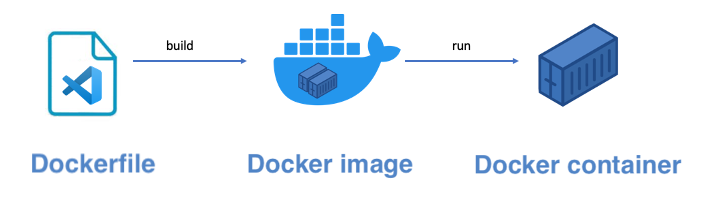
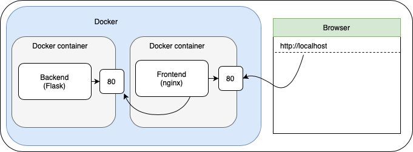

# Docker
In this week, you'll get familiar with the concept of "containers". You will look at what containers are, how you can use them and finally how to create containers for your own application. The assignments are structured in such a way that you'll be guided from introduction to final implementation, where the need to "experiment" increases over time. Therefore it is **highly** recommended that you follow our steps and confirm that you understand each step before proceeding.

## Resources
**Video:** [Learn Docker in 7 Easy Steps - Full Beginner's Tutorial](https://www.youtube.com/watch?v=gAkwW2tuIqE)
A quick overview of Docker. This video provides an overview of Docker and how it works. In this assignment we will discuss all the different topics so don't worry if things go to fast in the video.

## Tasks
### Install Docker
**Tutorial:** [Install Docker Engine on Ubuntu (Windows / WSL)](https://docs.docker.com/engine/install/ubuntu/)  
or
**Tutorial:** [Install Docker Desktop with WSL2 backend (Windows/Wsl)](https://docs.docker.com/desktop/windows/wsl/#:~:text=Start%20Docker%20Desktop%20from%20the,will%20be%20enabled%20by%20default)  
Follow this tutorial if you are using a Windows computer.

**Tutorial:** [Install Docker Desktop on Mac](https://docs.docker.com/desktop/install/mac-install/)
Follow this tutorial if you are using a Mac computer.

### Verify your Docker installation (and possible fixes)
To verify that docker has been installed correctly run the following command:

```sh
$ sudo docker version
```

The first thing you will notice is that there will be an error, stating *Cannot connect to Docker daemon*: This is because the Docker Engine hasn't actually started yet.
There should be some information about the *client*. You will use this client to instruct the engine *what to do*. The engine itself is a background process.

Start the Docker Engine by running.
```sh
$ sudo systemctl start docker.service
```
Note that starting the docker service does not mean that it will automatically start after a reboot. If you want to automatically start the docker service after a reboot you should 'enable' it as follows:

```sh
$ sudo systemctl enable docker.service
```

In order to work with the docker service, you'll need permission to do so. Add yourself to the `docker` group using this command:

```sh
$ sudo usermod -aG docker $USER
```

Note that you should restart your console at this point as changes in group are not immediately reflected in a running shell. (Alternatively you can reboot your system.)

Now confirm that the engine has started by repeating the first command (`docker version`) before doing the check below.

### Hello Docker!
To verify that your Docker runtime works correctly, run the "hello-world" docker image and study it's output. A docker image contains the files needed to run a particular application. Running the docker image in a docker container will execute the application stored in the image. 
        
To launch a new container with the "hello-world" image, run:
```
$ docker run hello-world
```

As you can see, the required image will be downloaded automatically and a container is started. The output should look something like:

```
Hello from Docker!
This message shows that your installation appears to be working correctly.
...
```

If you see output above it means docker is correctly installed on your laptop. If not, please ask your teacher for help.

## Assignments
### 0. Primer
**Tutorial:** [How to Create Dockerfile step by step and Build Docker Images using Dockerfile](https://automateinfra.com/2021/04/11/how-to-create-dockerfile-step-by-step-and-top-5-dockerfile-examples/)
Explains how to create custom Docker images with a Dockerfile

At this point you should have docker installed and should have run your first ("Hello World") container. Before we dive deeper into Docker we want to have a look at how this "Hello World" container works. Containers are running **Docker Images**. For our "Hello World" container we have used an image that was already created. This image can be found on [Docker Hub](https://hub.docker.com/_/hello-world/).

Where does the image come from? This image was build using a `Dockerfile` and then uploaded to Docker Hub for everyone to use. The process from Dockerfile to a running container is shown below. 



The purpose of this objective it to create and run our own "Hello World" container. In the `0-primer` folder you will find a `Dockerfile` and `analysis.txt` file. Have a look at the Dockerfile and try to understand what everything means. Then open the `analysis.txt` and follow the instructions.

### 1. Your first container
Let's build a Docker image that can run a static website. In the template folder you will find a folder called `1-container`. It contains a simple static website that you can run using the provided script (`start.sh`). The script also logs the requests to a file called `log.txt`. Run the script, visit the website (on port 9000) and validate that the log file is created and contains the requests.
                
Your task is to finish the Dockerfile so that:
1. the container should have `/app` as working directory
2. copy the required files to the working directory
3. last but not least you should run the `start.sh` script using the [CMD](https://docs.docker.com/engine/reference/builder/#cmd) command to serve the website.

Run your container and validate it by opening the following url in your browser: http://localhost:9000 (you should see the static website).

### 2. Script your container management
**Documentation:** [Docker detached mode](https://www.freecodecamp.org/news/docker-detached-mode-explained/)
The option --detach or -d, means that a Docker container runs in the background of your terminal. 

When you run your container from the terminal the information from the container is displayed in your terminal. This is because the container is running in the foreground. By running the container in detached mode you can move this to the background. 

In the template folder you will find a `todo.sh` script. Edit the script so that when you run `./todo.sh 1` it will build and run the container in detached mode and with a proper name.  
                 
### 3. Container diagnostics
**Tutorial:** [Getting Into a Docker Container’s Shell](https://www.baeldung.com/ops/docker-container-shell)
A small tutorial that explains how to run an interactive shell in the container.

Sometimes your container does not behave like it should. In such cases it is useful to 'connect' to your container (running a terminal) and see what is happening inside. Note that the container is a basic linux environment. So most linux commands can be used. 

Currently your container logs the requests to the static website. Your task is to:
1. Shell to the container (run it if it is not running yet).
2. Locate the `log.txt` in the container.
3. Copy its contents (using the linux `cat` command and copy/paste) to the `1-container/container.log` file in your template folder.

*Tip:* With `docker ps` you can see your running containers. 

### 4. Run existing images
**Video:** [Docker Volumes explained in 6 minutes](https://www.youtube.com/watch?v=p2PH_YPCsis)
In this video the concept of Docker volumes is explained. Stop watching after 4:14 minutes (the section about docker-compose is not required at this point).

**Video:** [8 Basic Docker Commands (docker ports, docker port mapping)](https://youtu.be/xGn7cFR3ARU?t=608)
In this video the concept of Docker ports and port mapping are explained. 

Aside from building your own images you can also leverage existing images. For example, [nginx](https://www.nginx.com) (a frequently used web server application) is also available as a Docker image, [see](https://hub.docker.com/_/nginx/). Give it a try by running `docker run --name my-nginx -p 8080:80 nginx`. What do you see when you open your browser at http://localhost:8080?

Your task is to use serve the static website using nginx. You should:
1. Find out where the nginx's default folder for serving static content is located.
2. Start nginx with a *volume map* for this folder, mapping to `1-container` folder on your host machine. The *Hello Docker* page should show up in your browser.
3. Edit the script such that running `./todo.sh 2` will start nginx with the above volume mapping such that is available on port http://localhost:8080 of the host machine.

### 5. Reverse proxy
**Documentation:** [NGINX Reverse Proxy](https://docs.nginx.com/nginx/admin-guide/web-server/reverse-proxy/)
Explains how to configure nginx as a reverse proxy (carefully read the section "Passing a Request to a Proxied Server")

A reverse proxy is a server that forwards client requests to another web server and serves the response back to the client. Have a look a the provided resource to understand how this can be done using nginx.

Your task is to configure the default nginx container as a reverse proxy. You should:
1. locate and study the nginx configuration file (note that the nginx.conf does not need to be edited)
2. create a volume mapping between the configuration file provided in the template (see `2-reverse-proxy`)
3. edit the `2-reverse-proxy/reverse_proxy.conf` file so that request to 'http://localhost:8080/search' are forwarded to google.com
4. edit the script so that when you run `./todo.sh 3` it will serve serve the static website using nginx and reverse proxy requests to '/search' to google.com. You may reuse your script from the previous object.

### 6. Docker Compose
**Video:** [Docker Compose in 12 Minutes](https://www.youtube.com/watch?v=Qw9zlE3t8Ko)
Learn how to get multiple Docker containers to work together.

**Tutorial:** [Get started with Docker Compose](https://docs.docker.com/compose/gettingstarted/)
This tutorial explains how to create a simple web application using Docker Compose.

Finally we have Docker Compose which can be used to run multiple containers together. With Docker Compose you can configure which images to build and which containers to run in one single file (called `docker-compose.yml`).

Your task is to edit the `docker-compose.yml` in the `3-compose` folder so that a standard nginx container is started with:
1. a volume mapping to the static website (`1-container`)
2. and a port mapping to port 8080 (making the website reachable from http://localhost:8080).

When you run `docker compose up` the website should be displayed.

### 7. Bring it all together
In this assignment we will bring all aspects from the previous objects together into one objective. Your task will be to run a frontend and backend application in separate containers (using docker compose) as shown in the image below. 



You should edit the `todo.sh` so that running `./todo.sh 4` will do everything that is required to run the application when running `docker compose up` (which should be the final command in the script). Your script should take the following requirements into account:

1. For your frontend container:
    - The code can be found at [https://gitlab.com/sealy/simple-todo-app](https://gitlab.com/sealy/simple-todo-app). Git clone this repository into the `4-complete/frontend` folder (from within your script).
    - The git repository has a branch called `backend-connection`, switch to this branch using `git checkout`.
    - The frontend should be served using nginx and should be **built first**. When you run `npm build` a distribution is created in a folder called `dist`. The contents of this `dist` folder can be served with an nginx container using a volume mapping. Configure this in the `docker-compose.yml` file. In your docker compose you should:
        - Use an off-the-shelf web server container (nginx) with the local port (80) mapped to the host computer on port 8080.
        - Use a volume mapping to serve a distribution (dist) folder of the frontend app.
        - Configure Nginx to use a reverse proxy that redirects request from [http://localhost:8080/todos](http://localhost/todos) to the backend container. Note that you can use name of the container (*backend*) in your docker-compose file as a hostname within your nginx reverse proxy configuration file.
2. For your backend container:
    - The backend code can be found at [https://gitlab.com/sealy/simple-todo-backend](https://gitlab.com/sealy/simple-todo-backend). Git clone this repository to the `4-complete/backend` folder (from within your script).
    - The backend is a Flask application that can be run using Poetry. Edit the `Dockerfile` in `4-complete/backend` folder so that a Docker image is created with Poetry installed and the required files from the backend git repository (copied) into it. 
    - Note that the backend application runs on port 80. You should do a port mapping to get the backend to run to port 8081 on you host computer. Don't forget to expose the port (80) in your Dockerfile.            

### 8. Clean up
**Tutorial:** [Complete Guide for Removing Docker Images](https://linuxhandbook.com/remove-docker-images/)
Explains the various ways to remove a docker image

Implement the clean up script (`./todo.sh 5`). It should:
1. Stop all your containers (so other containers should not be stopped)
2. Remove your images (please leave the other images alone)
