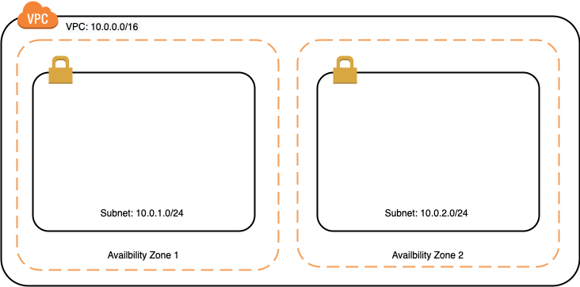
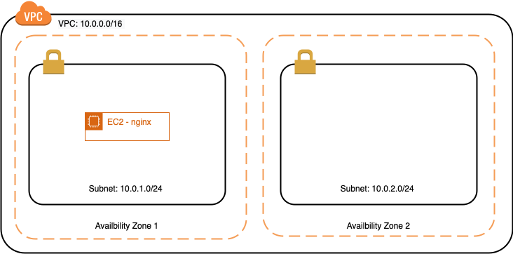
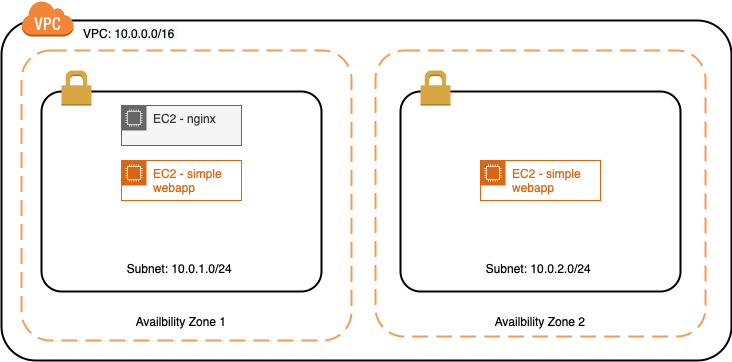
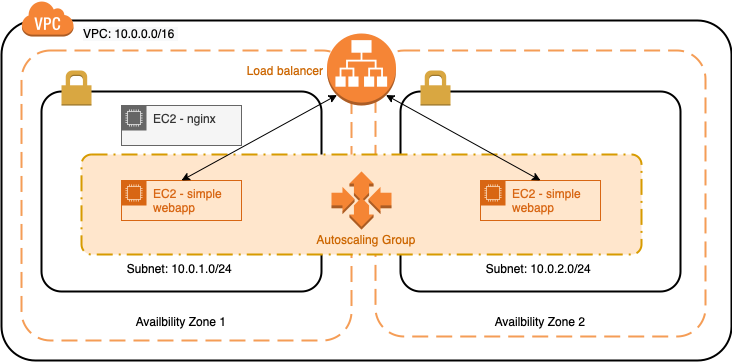

# Cloud
In this assignment you will get to know the basic building blocks for creating an infrastructure in the cloud using Amazon Web Services (AWS).

## Resources
**Video:** [AWS In 10 Minutes](https://www.youtube.com/watch?v=r4YIdn2eTm4)
Introduction to what AWS is.

## Tasks
### Getting access to AWS
In order to get access to a sandbox AWS environment you will need to log into AWS.
Please ask your teacher to provide you access to the AWS console.

## Assignements
### 1. Set up networking
**Documentation:** [How Amazon VPC works](https://docs.aws.amazon.com/vpc/latest/userguide/how-it-works.html)
The official AWS documentation explaining what a VPC is.

**Documentation:** [Working with VPCs and subnets](https://docs.aws.amazon.com/vpc/latest/userguide/working-with-vpcs.html)
The following procedures are for manually creating a VPC and subnets. You also have to manually add gateways and routing tables. 

Create a virtual private cloud (VPC) for the provided infrastructure design in the image below.

Note that you should use the IP ranges described in the image. Your final infrastructure should have two public subnets - one in a separate Availability Zone - and correct routing within the VPC. An internet gateway should provide access to the VPC.

### 2. Create your first instance
**Video:** [Amazon EC2 Security Groups Tutorial](https://youtu.be/nA3yN76cNxo)
Explains how security groups work within AWS and how you can configure inbound and outbound traffic using them.

Launch an EC2 instance in one of the two subnets. 

For your instance you should use an Ubuntu 20.04 image and the `t2.micro` instance type. Be sure to launch the instance in the correct VPC and subnet. In the security group you should allow internet access for port 80. 

*Note*: Please give your instance a "Name" tag so you can find it later on in your list of instances. As a best practice you should always provide a Name tag to your AWS resources.

After you have successfully created your EC2 instances you should open an SSH connection to each instance and install Nginx on them. To validate whether everything is installed correctly you should navigate with your browser to the public IP of the instance and see the Nginx welcome page.
    
*Note:* Do not lose your keypair. You need it to access you EC2 instance.

### 3. Create high available instances
**Tutorial:** [How to Set Environment Variables in Linux](https://www.serverlab.ca/tutorials/linux/administration-linux/how-to-set-environment-variables-in-linux/)
This tutorial explains how to set and unset environment variables in Linux.

The subnets in your VPC are both created in separate Availability Zones. This means that they are created in data centers located in different regions. If one of these data centers fails then the resources in the data centers of the other availability zones is still available. This makes it possible to create highly available services which are services that run on multiple server and continue running if one server stops.

The first step in creating these high available services is to create two Ubuntu 20.04 instances in the different availability zones (like in the figure below). Afterwards you will need to configure a load balancer and autoscaling group to make it all high available. 

Before we can configure load balancing we need a way to make a distinction between the two instances. In [this](https://gitlab.com/sealy/simple-webapp) git repository you will find a simple web application that displays the host name and the current date and time. You should SSH to each instance and clone the repository. After the repository had been cloned you can run the application by first running `npm install` and then `npm run start`. Note that you should have *node* and *npm* installed on the instance. Install them first if this is not the case. By default the application runs on port 3000. You can change this port by setting the PORT environment variable. Also see the *README.md* file.

Once installed you should see the instance IP address displayed on the page when you navigate to that IP address in your browser.

### 4. Load balance the instances
**Video:** [AWS EC2 Elastic Load Balancing Introduction](https://youtu.be/E-RYaMn348g)
Explains how load balancing in AWS works.

**Video:** [AWS Elastic Load Balancing Tutorial](https://youtu.be/OGEZn50iUtE)
This step-by-step tutorial explains how to create and configure a load balancer in AWS. 

In this assignment we are going to load balance the HTTP traffic to both instances. Currently you have to know the IP address (or DNS name) of the instance in order to reach it. With a load balancer you can route traffic to one of the two instances using a single DNS name (in other words via one single URL). Create and configure a load balancer so that it load balances the traffic to these two instances. 

The load balancer works when the web app on one of the instances is shown when you navigate to the load balancers DNS in your browser. Refreshing the page should (sometimes) display the page on the other instance. Be sure to set up the security in such a way that the instances are only accessible via the load balancer.

### 5. Autoscale your instances
**Video:** [AWS Auto Scaling Groups Introduction](https://youtu.be/jvMoWjsP7Pk)
 Explains how Auto Scaling Groups in AWS work.

**Video:** [Auto Scaling Groups Tutorial](https://youtu.be/NNrDr8cnUzs)

To complete our high availability infrastructure we will use an autoscaling group to add more instances when the load on the servers becomes too high (and remove instances when te load is very low). 

In this assignment you should do the following:
1. Stop the instances currently running the simple web application. DON'T terminate them!
2. Remove the instances from the load balancers target group.
3. Create an auto scaling group to launch new instances. The auto scaling group should have a minimum size of 2, a desired size of 2 and a maximum size of 4. Use the user data to clone the git repository and install and run the simple web app. As a scaling policy you should set the "Application Load Balancer Request Count Per Target". Give it a very low threshold value so that the scale out is easily triggered.

Your final infrastructure should look like this:

To validate whether the auto scaling works you should navigate to the DNS name of the load balancer in your browser. You should refresh the page a couple of times and check whether new instances are created. Note that this process can take a while (about 3 minutes) and it would be wise to use and auto refresh plugin for your browser (for example Tab Auto Refresh for Firefox). 

### 6. Serve static website using S3
**Tutorial:** [Module 1. Static Web Hosting](https://aws.amazon.com/getting-started/projects/build-serverless-web-app-lambda-apigateway-s3-dynamodb-cognito/module-1/)
A step-by-step tutorial on how to host a static web page on AWS using S3.

The Amazon Simple Storage Service (S3) is an object storage which can be used for many purposes like storing log files or media files and also static web content. S3 is designed to provide 99.999999999% durability and 99.99% availability of objects over a given year which means data is almost never lost.

For this objective you will create an S3 bucket and configure it to serve a static web application. The application you will need to put on S3 is a simple todo app found [here](https://gitlab.com/sealy/simple-todo-app). You should clone the git repository to your laptop and build it before you store it on S3.

### 7. Wrapping up
Because you are running the servers in a sandbox environment they will be stopped after a certain period of time. When you have completed this assignment you can stop the instances (but not terminate them). When you receive feedback on your work spin up the instances to get your implementation up and running again. For your auto scaling instances you should set the minimum and desired size of your auto scaling group to 0 and then terminated the existing instances.
